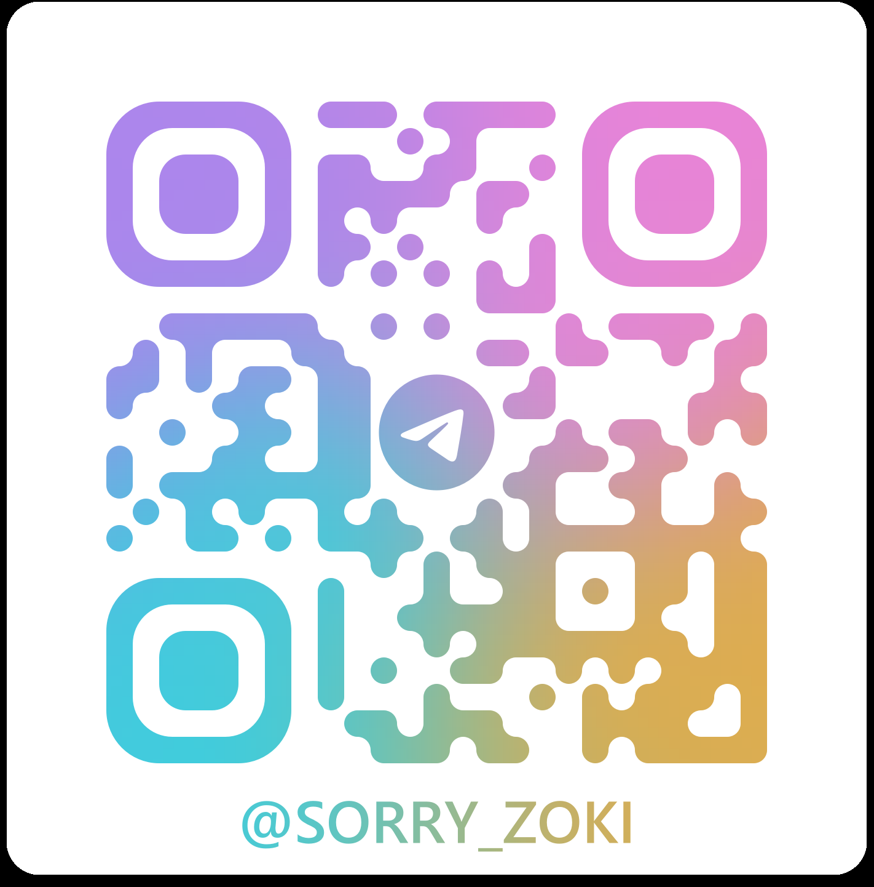

# Hi there 👋

---

> ### I work at the
> - 🔭 Educational and Methodological Center "Dialog" of UrFU as a programmer

---

> ### I’m currently learning
> - ❔ React
> - ❔ TypeScript
> - ❔ Algorithms
> - ❔ DevOps

---

> ### Projects in Frontend
> - 🔥 [STELLAR-BURGERS](https://github.com/hallomann/stellar-burgers.git)
> - 🔥 [WEB-LAREK](https://github.com/hallomann/web-larek-frontend.git)
> - 🔥 [MESTO-PROJECT](https://github.com/hallomann/mesto-project-ff.git)
> - 🔥 [ZAKRIVAYUSCHIY-TEG](https://github.com/hallomann/zakrivayuschiy-teg-f.git)

---

> ### Projects in Python
> - 🔥 [HCT-HOMEWORKS](https://github.com/hallomann/hct-homeworks.git)

---

> ### How to get to know me
> - ⭐ [GitHub](https://github.com/hallomann)
> - ⭐ [LeetCode](https://leetcode.com/hallo-mann/)

---

> ### How to contact me
> - ⭐ [G-MAIL](aleksandr.eroschkin@gmail.com): `aleksandr.eroschkin@gmail.com`
> - ⭐ [YANDEX-MAIL](AleksandrEroschkin.mann@yandex.ru): `AleksandrEroschkin.mann@yandex.ru`
> - ⭐ [VK](https://vk.com/aleksandr.eroshkin): `https://vk.com/aleksandr.eroshkin`
> - ⭐ [TELEGRAM](image.png): 
    

---

> ### Useful Links
> - ⚡ [GitHub Icons](https://willkyu.github.io/ZONE/Emoji/Emoji.html)

---

<!--
**hallomann/hallomann** is a ✨ _special_ ✨ repository because its `README.md` (this file) appears on your GitHub profile.

Here are some ideas to get you started:

- 🔭 I’m currently working on ...
- 🌱 I’m currently learning ...
- 👯 I’m looking to collaborate on ...
- 🤔 I’m looking for help with ...
- 💬 Ask me about ...
- 📫 How to reach me: ...
- 😄 Pronouns: ...
- ⚡ Fun fact: ...
-->
